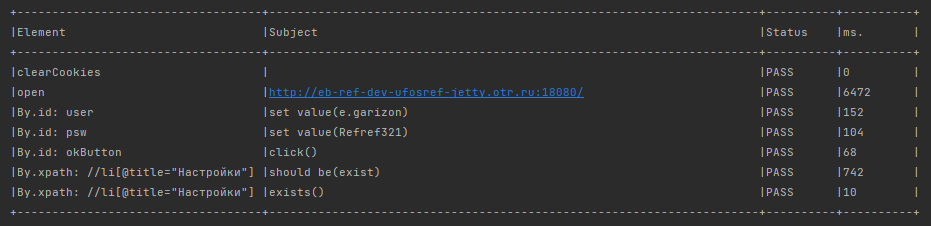

## Autotests-java

## Описание
Утилита для автоматизированного тестирования

Используемые технологии: 
- **Selenide**
- **Junit5**

Проект состоит из 2 частей:
- ***Основа проекта (core)*** - находится по пути `src/main/java`. Также для основной части проекта есть конфиги, лежат по пути `src/main/resoureces`, в которых устанавливается базовый урл Уфоса, выбор браузера и прочие настройки веб-драйвера.
- ***Тесты*** - находятся по пути `src/test/java`.

Запуск тестов производится с терминала из корневой директории проекта, командой `mvn clean test`. Также можно использовать доп. параметр `-Dbrowser=BROWSER`, где, вместо BROWSER следует указать обозначение желаемого браузера (вместо конфигурации в application.properties). Поддерживаемые браузеры - **chrome, firefox, ie, edge**. Пример команды с параметром: `mvn clean test -Dwebbrowser=chrome`. Если не указать браузер, то по стандарту будет использоваться Chrome.

Результатом прохождения теста будет подобная таблица с шагами и промежуточным результатом:

Если в результате прохода, тест упал - будет сохранено видео с прохождением теста, скриншот ошибки, а также лог. Найти всё это можно по пути `buid/reports/`